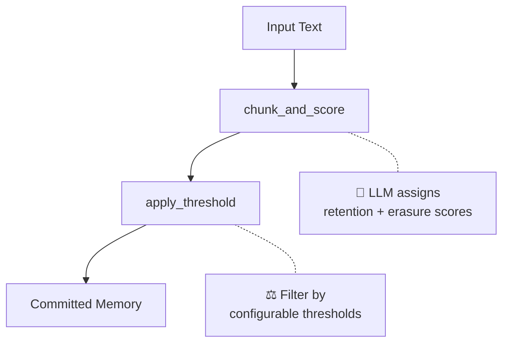

# ERASE: Explicit Retention And Selective Erasure

A dual-scored memory system that explicitly models **what to remember** and **what to forget**.

## Philosophy

> "Forgetting well is just as important as remembering well."

**The Problem with Current LLM Memory Systems:**
- Retrieves memories you'd rather **not** have retrieved
- Brings context that **hurts** more than it helps
- Focuses only on "what to keep" — forgetting is handled implicitly

**ERASE's Approach:**
- **Retention Score**: How important is this information to remember?
- **Erasure Score**: How safe is it to forget (or exclude) this information?

By explicitly modeling both dimensions, ERASE enables more nuanced, context-aware memory management.

## Future Direction

| Current | Future |
|---------|--------|
| Summarization | RAG Integration |
| "Forget" (delete) | "Exclude" (filter) |
| Remove from memory | Exclude from retrieval |

→ Enables **negative retrieval**: "Don't bring this chunk for this query"

## Architecture



## Quick Start

```bash
cd /path/to/erase
export OPENAI_API_KEY=...
uv run python main.py           # default thresholds
uv run python main.py strict    # aggressive pruning (forget more)
uv run python main.py lenient   # keep more memories
```
